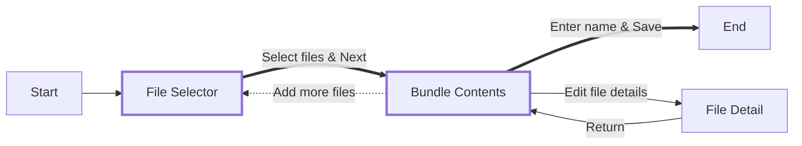

# Navigation

This document explains the workflow of a "Bundle Maker" application, showing the
steps involved in creating and saving a file bundle.

## Text Description

The application starts at the File Selector screen, where users choose files to
include in the bundle. The File Selector allows users to change the current
working directory (cwd), and displays the files in that directory. Files are
selected using checkboxes.

## File Selector

- choose multiple files with a checkbox mark pattern
- Proceed to the Bundle Contents screen by selecting "Next".
- Clear their file selections.
- Exit the application without saving

## Bundle Summary

- Lists chosen files
- Lets user remove files, change lines included (goes to File Detail Screen)
- Enter a bundle name and save the bundle. This action saves the bundle and
  exits the application.
- Select a button to add more files, which returns the user to the File Selector
  screen.

## File Detail

The File Detail screen allows users to select which parts of a file to include
in the bundle:

- The entire file can be selected.
- One or more line ranges can be specified (a single line is a valid line
  range).
- The file content is displayed.
- A controller lists the currently selected ranges and provides an "Add Range"
  function.
- "Add Range" presents two input boxes where the user can type the start and end
  lines of a range.
- After defining the desired ranges, the user returns to the Bundle Contents
  screen.

## Complete User Flow

